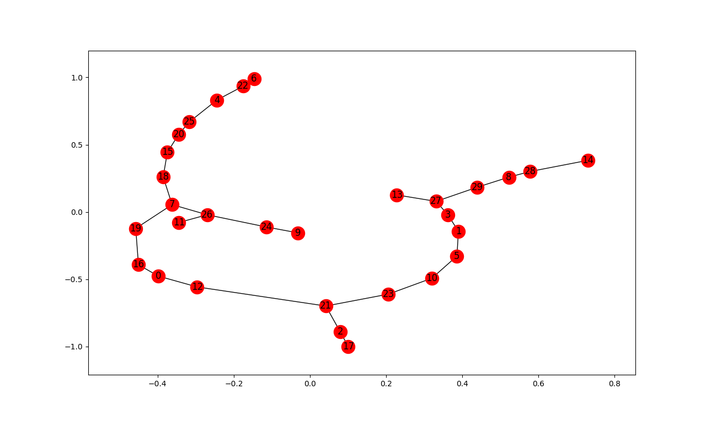

O algoritmo de Prim é uma técnica bastante utilizada na resolução de problemas relacionados à busca de caminhos otimizados.  
É um algoritmo [guloso](https://pt.wikipedia.org/wiki/Algoritmo_guloso) que recebe como entrada um grafo conectado, valorado e não direcionado e retorna uma [árvore geradora mínima (MST)](https://pt.wikipedia.org/wiki/%C3%81rvore_geradora_m%C3%ADnima)  
A ideia geral é encontrar um subgrafo do grafo original, onde a soma de todas as arestas deste subgrafo é a menor possível mantendo todos os vértices conectados.  

O problema que estamos tratando aqui, busca encontrar a MST de um [conjunto de dados](https://github.com/andrecgro/Grafos-UFSCAR-2017-2/blob/master/MST/ha30.zip) específicos através da implementação do algoritmo de Prim. Nossa implementação foi na linguagem Python, simplesmente por ter sido a orientação do professor e por conter bibliotecas específicas para trabalhar com Grafos.  
Abaixo vamos então explicar apresentar nosso código e destrinchá-lo, explicando o que (e porquê) estão acontecendo certas rotinas e/ou realizamos determinadas implementações:

Na imagem acima, estamos adicionando as bibliotecas sugeridas pelo professor em nosso código e inicializando a função principal (linha 5)  
A função prim, recebe um grafo G como parâmetro e logo no início cria uma flag de auxílio na lógica do código (first) pois temos que realizar um tratamento mais a frente caso seja o primeiro nó verificado. Além disso, recebe uma lista de nós da função [G.nodes()](https://networkx.github.io/documentation/networkx-1.10/reference/generated/networkx.Graph.nodes.html) (presente nas bibliotecas utilizadas)

A partir da linha 11, realizamos uma iteração passando por todos os nós do grafo e colocando inicializando seus atributos da forma necessária para iniciar de fato o algoritmo de Prim.
Os atributos que precisamos inicializar em cada nó são: *parent*, *visited* e *min_path* que servem para controlar o pai de cada nó em cada iteração, checar se a visita nele já foi completada ou não e atribuir o menor caminho para atingir este nó, respectivamente.
Para o primeiro nó, nós colocamos *min_path=0* e para o resto colocamos *min_path=+&infin;*.

Na linha 22 estamos realizando o mesmo procedimento da Figura 1 (linha 9), porém passamos um atributo *True* como parâmetro, indicando que queremos não só uma lista de nós mas também o atributo de cada nó (que foi inicializado no laço *for* da Figura 2)  
A ideia básica é realizar o laço *while* da linha 24 enquanto existir nós para serem visitados no grafo (que é exatamente a checagem feita pelo laço)  

Para cada passo do algoritmo nós inicializamos uma lista dos nós a serem visitados e percorremos todo o grafo, adicionando na lista os nós que possuem o atributo *visited* como False, ou seja, sua visita ainda não foi concluída. Esse processo todo ocorre da linha 26 até a linha 30 na Figura 3. Em seguida, da linha 32 à linha 36 nós escolhemos o nó com o menor caminho até este momento da execução, e que esteja na lista dos nós a serem visitados, para ser nosso nó pai. Ou seja, a partir deste nó escolhido começaremos a expandir novamente e a realizar as novas visitas das próximas iterações.  
Na linha 39 nós adicionamos todos os nós filhos do nó escolhido em uma lista chamada *neighbors*. Em seguida, para cada nó presente nessa lista, caso ele não tenha sido visitado, nós recuperamos o valor de seu caminho atual e comparamos com o seu caminho através deste novo nó escolhido como pai, caso o novo valor seja menor então atualizamos seu atributo *parent* e e *min_path*

Em resumo, o algoritmo visita todos os filhos de um nó, checando se o valor do *min_path* acessando este nó específico pelo pai atualmente setado é menor ou maior do que o valor *min_path* previamente estabelecido (por isso inicializamos todos, exceto o primeiro, como +&infin;). Caso o valor, acessando nesta iteração seja menor, então é atualizado o pai do nó e o valor do caminho até o mesmo.  
Após isso, na linha 51, nós colocamos o pai do nó em questão como visitado (porque já checamos todos os seus filhos) e partimos para a próxima iteração.

Da linha 54 à linha 62 nós estamos construindo a MST de fato, basicamente basta checar um por um na lista *all_nodes* se o pai de determinado elemento existe e se ele realmente foi visitado. Caso essas condições tenham sido satisfeitas, nós adicionamos na *mst* este nó e setamos seus atributos *parent* e *min_path*. O elemento que não tiver *parent* setado será a raiz de nossa árvore.

A partir da linha 65 estamos construindo nossa função principal do programa, que servirá simplesmente para carregar o dataset mencionado no começo do segundo parágrafo (linha 66 e 67), chamar a função *prim* para este dataset e renderizar a MST gerada, usando uma função da biblioteca [NetworkX](https://networkx.github.io/documentation/stable/index.html).  
Nas linhas 73 e 74 apenas usamos um método do Python para chamar a função *main* caso este arquivo seja executado (e dentro dela chamamos a função *prim(G)*  definida).

Para finalizar, gostaríamos de mostrar que a execução do algoritmo elaborado no dataset proposto, resultou a seguinte MST:

